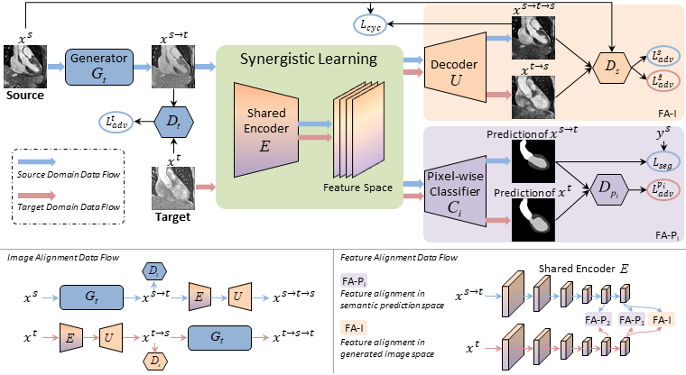

# Image Style Transfer for Brain Vessel Segmentation from multi-modal MRI
### EURECOM SEMESTER PROJECT - SPRING 2022
### Supervisors: Professor M. Zuluaga - F. Galati

## Unsupervised Bidirectional Cross-Modality Adaptation via Deeply Synergistic Image and Feature Alignment for Medical Image Segmentation

Tensorflow v2 implementation of the SIFA unsupervised cross-modality domain adaptation framework.  
Please refer to the branch [SIFA-v1](https://github.com/cchen-cc/SIFA/tree/SIFA-v1) for the original paper and code  

## Original Paper
[Unsupervised Bidirectional Cross-Modality Adaptation via Deeply Synergistic Image and Feature Alignment for Medical Image Segmentation](https://arxiv.org/abs/2002.02255)
 
IEEE Transactions on Medical Imaging
 
 

  

## Installation

## Data Preparation

## Train

## Acknowledgement
The code is a revisiting version of the original [SIFA Implementation](https://github.com/cchen-cc/SIFA/tree/SIFA-v1)
Part of the code is revised from the [Tensorflow implementation of CycleGAN](https://github.com/leehomyc/cyclegan-1).

