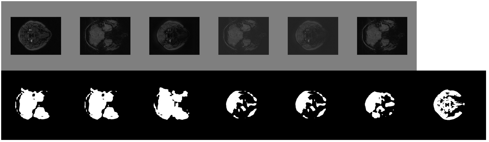

# Image Style Transfer for Brain Vessel Segmentation from multi-modal MRI - Tensorflow v2
### EURECOM SEMESTER PROJECT - SPRING 2022
### Supervisors: Professor M. Zuluaga - F. Galati

## Unsupervised Bidirectional Cross-Modality Adaptation via Deeply Synergistic Image and Feature Alignment for Medical Image Segmentation

Tensorflow v2 implementation of the SIFA unsupervised cross-modality domain adaptation framework.  
Please refer to the branch [SIFA-v1](https://github.com/cchen-cc/SIFA/tree/SIFA-v1) for the original paper and code  

## Original Paper
[Unsupervised Bidirectional Cross-Modality Adaptation via Deeply Synergistic Image and Feature Alignment for Medical Image Segmentation](https://arxiv.org/abs/2002.02255)
 
IEEE Transactions on Medical Imaging
 
 

  

## How to run

* Open and follow the "SIFA_Implementation_Tf2-.ipynb" jupyter notebook modifying the indicated variable and parameters to adapt it to your dataset.
* [N.B.] Cell Numbers (#n) are the one indicated in the current version of the used jupyter notebook and correspond to the In [n]: numbering of the cell
* Set the home_path in Cell #3 (here it corresponds to the same folder of the above mentioned notebook).
* Store your data inside a folder "data" in the home_path
* Store SWI images in /data/SWI and TOF images in /data/TOF (You can find an example folder for a single 3D image in cell #6)
* Select the wanted Spacing in cell #13 to allow images resizing (here SWI Spacing is chosen)
* Cell #23 contains all the useful statistics for OUR dataset: comment the last line to use the extracted ones from your data
* Slices are preprocessed in Cell #31 and transformed into Tfrecord in Cell #34 (Here you can modify the "tfrecords_folder" name)
* Modify the "percentage" parameter in the "split_file" function (Cell #35) to select the wanted train/validation split percentage
* You can use (or modify) the function in Cell #38 to remove previous SIFA Training outputs
* Cell #43 contains all the parameters you can set before the training
* Start Training by running Cell #44

* "Print losses" Section contains some Cells in order to create a "tot_losses.csv" file containing the loss-trend for each model loss given the name of an output folder ("date" variable, Cell #47). You can fine your file inside the "{date}/losses" path.
* You can also uncomment the last lines of Cell #63 to remove all the saved model of the selected output to save some space
* Last Section contains some Cells in order to plot all the Loss-Curves given the complete path of a .csv file ("file_name " variable, Cell #67). You can find the list of all the .csv in your home path by running Cell #64 or #66

## Data Preparation

## Training Result

* You can find all the output results in the folder "{home_path}/SIFA/ouput/{date}"
* imgs: Contains all the .jpg images that you can also find in the .html files
* nib_imgs: Same of imgs but contains all the .nii.gz
* losses: Contains the .txt files of all the loss, both individually in each file and all-toghether in tot_losses.csv

html visualization files:
* 1st Row: 6 Data images 
  1. $X_s$ : Input from the Source Domain
  2. $X_t$ : Input from the Target Domain
  3. $X_{s &#8594 t}$ : Transformed Image from Source to Target
  5. $X_{t &#8594 s}$ : Transformed Image from Target to Source
  6. $X_{s~}$ : Reconstructed Source Image ($X_{s &#8594 t &#8594 s}$)
  7. $X_{t~}$ : Reconstructed Source Image ($X_{t &#8594 s &#8594 t}$)

* 2nd Row: 7 Segmentation masks
  1. 'pred_mask_a' : Predicted Mask from $X_t$ ($Y_t$)
  2. 'pred_mask_b' : Same as 'pred_mask_a' [1](#myfootnote1)
  3. 'pred_mask_b_ll' : Predicted Mask from $X_{t &#8594 s}$ ($Y_{t &#8594 s}$)
  4. 'pred_mask_fake_a' : Predicted Mask from $X_s$ ($Y_s$) 
  5. 'pred_mask_fake_b' : Same as 'pred_mask_fake_a' [1](#myfootnote1)
  6. 'pred_mask_fake_b_ll' : Predicted Mask from $X_{s &#8594 t}$ ($Y_{s &#8594 t}$)
  7. 'gt' : Ground truth, $X_s$ given Mask ($Y_s$)

  

## Acknowledgement
The code is a revisiting version of the original [SIFA Implementation](https://github.com/cchen-cc/SIFA/tree/SIFA-v1)
Part of the code is revised from the [Tensorflow implementation of CycleGAN](https://github.com/leehomyc/cyclegan-1).

## Notes
<a name="myfootnote1">1</a>: Check model.py get_outputs() returns for further details
